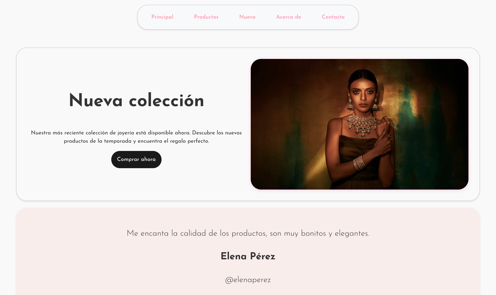
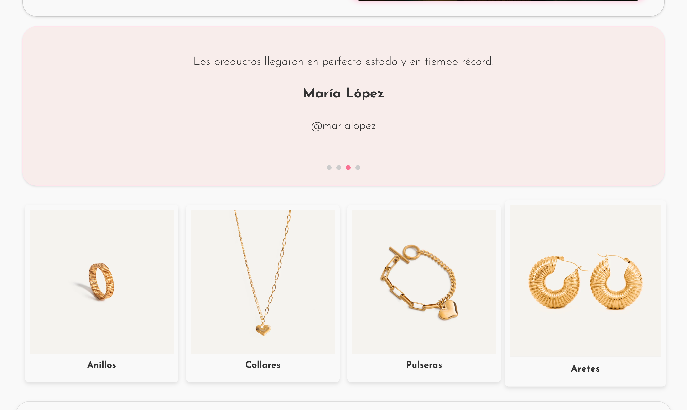
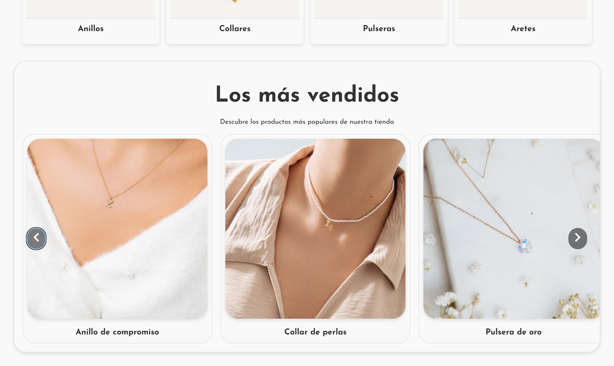

# Jewelry Shop Landing Page

This project is a jewelry shop landing page design inspired by minimalism. It is built using React + Vite and native CSS. Please note that this project is currently in development, with more versions and updates coming soon.

## Table of Contents

- [Introduction](#introduction)
- [Features](#features)
- [Installation](#installation)
- [Usage](#usage)
- [Contributing](#contributing)
- [License](#license)

## Introduction

The Jewelry Shop Landing Page is a modern and elegant design that aims to showcase the beauty and craftsmanship of jewelry. It follows a minimalist approach, focusing on clean lines, subtle colors, and high-quality imagery.

## Features

- Responsive design: The landing page is optimized for various screen sizes, ensuring a seamless experience across devices.
- Stunning visuals: The use of high-resolution images and carefully selected typography creates a visually appealing and engaging experience.
- Smooth animations: Delicate animations and transitions add a touch of elegance and sophistication to the overall design.
- Product showcase: The landing page includes a section to highlight featured products, allowing users to explore and learn more about each item.
- Contact form: A contact form is provided to enable users to get in touch with the jewelry shop for inquiries or requests.

## Image Credits

The current pictures used in this project are extracted from [Cindy Alvarez](https://cindyalvarez.com.co/). All copyrights reserved to them.

## Installation

To install and run the project locally, follow these steps:

1. Clone the repository: `git clone https://github.com/your-username/jewelry-shop.git`
2. Navigate to the project directory: `cd jewelry-shop`
3. Install dependencies: `npm install`
4. Start the development server: `npm run dev`

## Usage

Once the development server is running, you can access the jewelry shop landing page by opening your browser and navigating to `http://localhost:3000`.

Feel free to explore the different sections, interact with the animations, and test the contact form. Your feedback and suggestions are highly appreciated!

## Contributing

Contributions are welcome! If you have any ideas, suggestions, or bug reports, please open an issue or submit a pull request. Let's work together to make this jewelry shop landing page even better.

## License

This project is developed by Sebastián Escobar. The code can be inspected and modified for personal use and educational purposes. However, it is not free for commercial use. If you wish to use this project for commercial purposes, please contact me to discuss licensing options.
